# 🤖 Chatbot AI - Luồng Xử Lý Chi Tiết

> Tài liệu mô tả chi tiết cách chatbot AI hoạt động trong hệ thống LP SHOP

---

## 📑 Mục Lục

1. [Tổng Quan Kiến Trúc](#1-tổng-quan-kiến-trúc)
2. [Luồng Khởi Tạo Chat Session](#2-luồng-khởi-tạo-chat-session)
3. [Luồng Gửi Tin Nhắn](#3-luồng-gửi-tin-nhắn)
4. [Luồng Phân Tích Intent](#4-luồng-phân-tích-intent)
5. [Luồng Xử Lý Từng Intent](#5-luồng-xử-lý-từng-intent)
6. [Quản Lý Session với Redis](#6-quản-lý-session-với-redis)
7. [Tích Hợp Gemini AI](#7-tích-hợp-gemini-ai)
8. [Error Handling & Fallback](#8-error-handling--fallback)

---

## 1. Tổng Quan Kiến Trúc

### 1.1. High-Level Architecture


### 1.2. Tech Stack

| Component | Technology | Purpose |
|-----------|-----------|---------|
| **AI Model** | Google Gemini Pro | Natural Language Understanding |
| **Session Store** | Redis | Fast session management (TTL 1h) |
| **Database** | MongoDB | Product, Order, User data |
| **Backend** | Node.js + Express | API endpoints |
| **Frontend** | React/Next.js | Chat UI |

---

## 2. Luồng Khởi Tạo Chat Session

### 2.1. Sequence Diagram

```mermaid
sequenceDiagram
    actor User
    participant UI as Chat UI
    participant API as API Gateway
    participant Controller as Chat Controller
    participant Redis as Redis Cache
    participant DB as MongoDB
    participant Gemini as Gemini AI

    User->>UI: Click "Mở chat"
    UI->>API: POST /api/chat/init<br/>{Authorization: Bearer token}

    API->>Controller: Verify token & extract userId

    Controller->>DB: Get user info<br/>User.findById(userId)
    DB-->>Controller: {hoTen, diemTichLuy, email}

    Controller->>DB: Get recent orders<br/>Order.find({nguoiDung: userId}).limit(5)
    DB-->>Controller: [Order1, Order2, ...]

    Controller->>Controller: Generate sessionId<br/>uuid.v4()

    Controller->>Controller: Create chat session object
    Note over Controller: {<br/>  sessionId,<br/>  nguoiDung: userId,<br/>  messages: [],<br/>  context: {userName, loyaltyPoints, recentOrders},<br/>  createdAt<br/>}

    Controller->>Redis: Save session<br/>key: "chat:{sessionId}"<br/>TTL: 3600 (1 hour)
    Redis-->>Controller: OK

    Controller->>Gemini: Initialize AI context<br/>System prompt + User context
    Gemini-->>Controller: AI ready

    Controller-->>API: {<br/>  sessionId,<br/>  greeting: "Xin chào {userName}!"<br/>}
    API-->>UI: Session created
    UI-->>User: Display chatbox với greeting
```



### 2.2. Code Implementation

**API Endpoint:**
```javascript
// POST /api/chat/init
router.post('/init', protect, async (req, res) => {
  try {
    const userId = req.user._id

    // 1. Get user info
    const user = await User.findById(userId).select('hoTen diemTichLuy email')

    // 2. Get recent orders
    const recentOrders = await Order.find({ nguoiDung: userId })
      .sort({ createdAt: -1 })
      .limit(5)
      .select('madonHang trangThai tongTien ngayTao')

    // 3. Generate session ID
    const sessionId = uuidv4()

    // 4. Create session object
    const session = {
      sessionId,
      nguoiDung: userId,
      messages: [],
      context: {
        userName: user.hoTen,
        loyaltyPoints: user.diemTichLuy,
        recentOrders: recentOrders.map(order => ({
          orderId: order.maDonHang,
          status: order.trangThai,
          total: order.tongTien,
          date: order.ngayTao
        }))
      },
      createdAt: Date.now()
    }

    // 5. Save to Redis with 1 hour TTL
    await redisClient.setex(
      `chat:${sessionId}`,
      3600,
      JSON.stringify(session)
    )

    // 6. Initialize Gemini AI
    const chat = geminiModel.startChat({
      history: [],
      generationConfig: {
        temperature: 0.7,
        maxOutputTokens: 500
      }
    })

    // 7. Store chat instance (in-memory or Redis)
    chatInstances.set(sessionId, chat)

    res.json({
      success: true,
      data: {
        sessionId,
        greeting: `Xin chào ${user.hoTen}! Tôi có thể giúp gì cho bạn hôm nay?`
      }
    })

  } catch (error) {
    res.status(500).json({
      success: false,
      message: 'Lỗi khởi tạo chat session'
    })
  }
})
```

### 2.3. Session Structure

```javascript
{
  "sessionId": "550e8400-e29b-41d4-a716-446655440000",
  "nguoiDung": "64a7f123456789abcdef0001",
  "messages": [
    {
      "role": "user",
      "content": "Tôi muốn tìm giày bóng rổ",
      "timestamp": 1704038400000
    },
    {
      "role": "assistant",
      "content": "Tôi sẽ giúp bạn tìm giày bóng rổ...",
      "timestamp": 1704038405000,
      "intent": "product_search",
      "data": {
        "products": [...]
      }
    }
  ],
  "context": {
    "userName": "Nguyễn Văn A",
    "loyaltyPoints": 150,
    "recentOrders": [
      {
        "orderId": "ORD-20240101-001",
        "status": "da-giao",
        "total": 1500000,
        "date": "2024-01-01T10:00:00Z"
      }
    ]
  },
  "createdAt": 1704038400000
}
```

---

## 3. Luồng Gửi Tin Nhắn

### 3.1. Detailed Flow Diagram

```mermaid
graph TD
    Start([User gửi tin nhắn]) --> Validate{Validate<br/>sessionId}

    Validate -->|Invalid| Error1[Return Error 401<br/>Session không tồn tại]
    Validate -->|Valid| GetSession[Lấy session từ Redis]

    GetSession --> CheckExpired{Session<br/>còn hạn?}
    CheckExpired -->|Expired| Error2[Return Error 403<br/>Session hết hạn]
    CheckExpired -->|Valid| SaveUserMsg[Lưu user message<br/>vào session.messages]

    SaveUserMsg --> Moderate{Content<br/>Moderation}

    Moderate -->|Spam/Toxic| Error3[Return Warning<br/>Nội dung không phù hợp]
    Moderate -->|Clean| DetectIntent[Detect Intent<br/>Gemini AI]

    DetectIntent --> RouteIntent{Intent<br/>Type}

    RouteIntent -->|product_search| HandleProduct[Xử lý tìm sản phẩm]
    RouteIntent -->|order_status| HandleOrder[Xử lý tra đơn hàng]
    RouteIntent -->|voucher_inquiry| HandleVoucher[Xử lý voucher]
    RouteIntent -->|product_compare| HandleCompare[Xử lý so sánh SP]
    RouteIntent -->|general_question| HandleGeneral[Xử lý câu hỏi chung]

    HandleProduct --> GenerateResponse[Generate AI Response]
    HandleOrder --> GenerateResponse
    HandleVoucher --> GenerateResponse
    HandleCompare --> GenerateResponse
    HandleGeneral --> GenerateResponse

    GenerateResponse --> SaveAIMsg[Lưu AI response<br/>vào session.messages]
    SaveAIMsg --> UpdateRedis[Update session<br/>trong Redis]
    UpdateRedis --> Response([Return response<br/>to User])

    style Start fill:#4caf50,color:#fff
    style Response fill:#2196f3,color:#fff
    style Error1 fill:#f44336,color:#fff
    style Error2 fill:#f44336,color:#fff
    style Error3 fill:#ff9800,color:#fff
```



### 3.2. API Implementation

```javascript
// POST /api/chat/message
router.post('/message', protect, async (req, res) => {
  try {
    const { sessionId, message } = req.body
    const userId = req.user._id

    // 1. Validate & Get session
    const sessionData = await redisClient.get(`chat:${sessionId}`)
    if (!sessionData) {
      return res.status(401).json({
        success: false,
        message: 'Session không tồn tại hoặc đã hết hạn'
      })
    }

    const session = JSON.parse(sessionData)

    // 2. Verify ownership
    if (session.nguoiDung !== userId.toString()) {
      return res.status(403).json({
        success: false,
        message: 'Unauthorized'
      })
    }

    // 3. Content moderation
    const moderationResult = await moderateContent(message)
    if (!moderationResult.safe) {
      return res.status(400).json({
        success: false,
        message: 'Nội dung không phù hợp. Vui lòng sử dụng ngôn từ lịch sự.'
      })
    }

    // 4. Save user message
    session.messages.push({
      role: 'user',
      content: message,
      timestamp: Date.now()
    })

    // 5. Detect intent
    const intent = await detectIntent(message, session.context)

    // 6. Handle based on intent
    let responseData
    switch (intent.type) {
      case 'product_search':
        responseData = await handleProductSearch(intent, session)
        break
      case 'order_status':
        responseData = await handleOrderStatus(intent, session)
        break
      case 'voucher_inquiry':
        responseData = await handleVoucherInquiry(intent, session)
        break
      case 'product_compare':
        responseData = await handleProductCompare(intent, session)
        break
      default:
        responseData = await handleGeneralQuestion(message, session)
    }

    // 7. Generate AI response
    const aiResponse = await generateAIResponse(responseData, session)

    // 8. Save AI message
    session.messages.push({
      role: 'assistant',
      content: aiResponse.text,
      timestamp: Date.now(),
      intent: intent.type,
      data: responseData
    })

    // 9. Update session in Redis (refresh TTL)
    await redisClient.setex(
      `chat:${sessionId}`,
      3600,
      JSON.stringify(session)
    )

    // 10. Return response
    res.json({
      success: true,
      data: {
        message: aiResponse.text,
        intent: intent.type,
        suggestions: aiResponse.suggestions,
        products: responseData.products,
        orders: responseData.orders
      }
    })

  } catch (error) {
    console.error('Chat error:', error)
    res.status(500).json({
      success: false,
      message: 'Có lỗi xảy ra. Vui lòng thử lại.'
    })
  }
})
```

---

## 4. Luồng Phân Tích Intent

### 4.1. Intent Detection Flow

```mermaid
graph TD
    Start([User Message]) --> Preprocess[Tiền xử lý<br/>- Lowercase<br/>- Remove diacritics<br/>- Tokenize]

    Preprocess --> KeywordMatch{Keyword<br/>Matching}

    KeywordMatch -->|Match| Intent1{Keywords<br/>Type}
    KeywordMatch -->|No Match| GeminiAnalyze[Gemini AI<br/>Deep Analysis]

    Intent1 -->|tìm, mua, giá| ProductSearch[Intent:<br/>PRODUCT_SEARCH]
    Intent1 -->|đơn hàng, order, tracking| OrderStatus[Intent:<br/>ORDER_STATUS]
    Intent1 -->|voucher, giảm giá, mã| VoucherInquiry[Intent:<br/>VOUCHER_INQUIRY]
    Intent1 -->|so sánh, khác nhau| ProductCompare[Intent:<br/>PRODUCT_COMPARE]
    Intent1 -->|chính sách, đổi trả| PolicyQuestion[Intent:<br/>POLICY_QUESTION]

    GeminiAnalyze --> ExtractIntent[Extract Intent<br/>+ Entities]
    ExtractIntent --> ProductSearch
    ExtractIntent --> OrderStatus
    ExtractIntent --> VoucherInquiry
    ExtractIntent --> ProductCompare
    ExtractIntent --> PolicyQuestion

    ProductSearch --> ExtractEntities[Extract Entities<br/>- Product category<br/>- Brand<br/>- Price range<br/>- Features]
    OrderStatus --> ExtractEntities
    VoucherInquiry --> ExtractEntities
    ProductCompare --> ExtractEntities
    PolicyQuestion --> ExtractEntities

    ExtractEntities --> Result([Return Intent Object])

    style Start fill:#4caf50,color:#fff
    style Result fill:#2196f3,color:#fff
```



### 4.2. Intent Detector Implementation

```javascript
async function detectIntent(message, context) {
  // 1. Preprocess message
  const normalized = message
    .toLowerCase()
    .normalize('NFD')
    .replace(/[\u0300-\u036f]/g, '')
    .replace(/đ/g, 'd')

  // 2. Keyword-based quick detection
  const patterns = {
    product_search: /\b(tim|mua|gia|san pham|giay|quan ao|bong)\b/,
    order_status: /\b(don hang|order|tracking|giao hang|van chuyen)\b/,
    voucher_inquiry: /\b(voucher|ma giam gia|khuyen mai|discount|giam gia)\b/,
    product_compare: /\b(so sanh|khac nhau|tot hon|nen chon|giong)\b/,
    policy_question: /\b(chinh sach|doi tra|bao hanh|hoan tien)\b/
  }

  for (const [intentType, pattern] of Object.entries(patterns)) {
    if (pattern.test(normalized)) {
      return await extractEntities(message, intentType, context)
    }
  }

  // 3. Use Gemini AI for deep analysis
  const prompt = `
Phân tích ý định (intent) của câu hỏi sau trong ngữ cảnh mua sắm thể thao:

Câu hỏi: "${message}"

Context:
- Tên khách hàng: ${context.userName}
- Điểm tích lũy: ${context.loyaltyPoints}
- Đơn hàng gần nhất: ${JSON.stringify(context.recentOrders[0] || {})}

Trả về JSON với format:
{
  "intent": "product_search|order_status|voucher_inquiry|product_compare|policy_question|general",
  "confidence": 0.0-1.0,
  "entities": {
    "category": "string",
    "brand": "string",
    "priceRange": {"min": number, "max": number},
    "keywords": ["string"]
  }
}
`

  const result = await geminiModel.generateContent(prompt)
  const response = await result.response
  const text = response.text()

  try {
    const parsed = JSON.parse(text)
    return parsed
  } catch (error) {
    console.error('Failed to parse intent:', error)
    return {
      intent: 'general',
      confidence: 0.5,
      entities: {}
    }
  }
}

async function extractEntities(message, intentType, context) {
  const entities = {}

  // Extract category
  const categories = ['giay', 'quan', 'ao', 'bong', 'vot', 'phu kien']
  for (const cat of categories) {
    if (message.includes(cat)) {
      entities.category = cat
      break
    }
  }

  // Extract brand
  const brands = await getBrandNames() // From MongoDB
  for (const brand of brands) {
    if (message.toLowerCase().includes(brand.toLowerCase())) {
      entities.brand = brand
      break
    }
  }

  // Extract price range
  const priceMatch = message.match(/(\d+)\s*(trieu|k|dong)/gi)
  if (priceMatch) {
    entities.priceRange = parsePriceRange(priceMatch)
  }

  return {
    intent: intentType,
    confidence: 0.9,
    entities
  }
}
```

---

## 5. Luồng Xử Lý Từng Intent

### 5.1. Product Search Intent

```mermaid
graph TD
    Start([Intent: PRODUCT_SEARCH]) --> Extract[Extract Entities<br/>- Category<br/>- Brand<br/>- Price Range<br/>- Keywords]

    Extract --> BuildQuery[Build MongoDB Query]

    BuildQuery --> Query{Query<br/>Params}

    Query -->|Has category| AddCategory[filter.danhMuc = category]
    Query -->|Has brand| AddBrand[filter.thuongHieu = brand]
    Query -->|Has price| AddPrice[filter.gia >= min && <= max]

    AddCategory --> Execute[Execute Query<br/>Product.find(filter)]
    AddBrand --> Execute
    AddPrice --> Execute

    Execute --> CheckResults{Results<br/>Count}

    CheckResults -->|0 results| Suggest[Gợi ý sản phẩm<br/>tương tự]
    CheckResults -->|1-5 results| Direct[Hiển thị trực tiếp]
    CheckResults -->|> 5 results| Sort[Sort by relevance<br/>Limit 5]

    Suggest --> Format[Format Response]
    Direct --> Format
    Sort --> Format

    Format --> Enrich[Enrich with AI<br/>- Descriptions<br/>- Recommendations<br/>- FAQs]

    Enrich --> Response([Return Products<br/>+ AI Commentary])

    style Start fill:#4caf50,color:#fff
    style Response fill:#2196f3,color:#fff
```

**Code:**
```javascript
async function handleProductSearch(intent, session) {
  const { entities } = intent

  // 1. Build query filter
  const filter = { trangThai: 'active' }

  if (entities.category) {
    const category = await Category.findOne({
      slug: slugify(entities.category)
    })
    if (category) {
      filter.danhMuc = category._id
    }
  }

  if (entities.brand) {
    const brand = await Brand.findOne({
      slug: slugify(entities.brand)
    })
    if (brand) {
      filter.thuongHieu = brand._id
    }
  }

  if (entities.priceRange) {
    filter.gia = {
      $gte: entities.priceRange.min,
      $lte: entities.priceRange.max
    }
  }

  // 2. Execute query
  const products = await Product.find(filter)
    .populate('danhMuc thuongHieu')
    .sort({ daBan: -1, danhGiaTrungBinh: -1 })
    .limit(5)
    .lean()

  // 3. If no results, suggest alternatives
  if (products.length === 0) {
    const alternatives = await Product.find({ trangThai: 'active' })
      .sort({ noiBat: -1, daBan: -1 })
      .limit(5)
      .lean()

    return {
      products: alternatives,
      isAlternative: true,
      originalQuery: entities
    }
  }

  return {
    products,
    isAlternative: false
  }
}
```

### 5.2. Order Status Intent

```mermaid
graph TD
    Start([Intent: ORDER_STATUS]) --> Extract[Extract Order ID<br/>từ message]

    Extract --> HasOrderId{Order ID<br/>found?}

    HasOrderId -->|Yes| QueryById[Query Order<br/>by Order ID]
    HasOrderId -->|No| QueryRecent[Query recent orders<br/>of user]

    QueryById --> Verify{Verify<br/>Ownership}
    QueryRecent --> Display[Display order list]

    Verify -->|Not owner| Error[Return Error<br/>Unauthorized]
    Verify -->|Owner| GetDetails[Get Order Details<br/>+ Tracking Info]

    GetDetails --> CheckStatus{Order<br/>Status}

    CheckStatus -->|cho-xac-nhan| Status1[Đang chờ xác nhận]
    CheckStatus -->|dang-giao| Status2[Đang giao hàng<br/>+ Tracking number]
    CheckStatus -->|da-giao| Status3[Đã giao thành công]
    CheckStatus -->|da-huy| Status4[Đã hủy<br/>+ Lý do]

    Status1 --> Format[Format Response]
    Status2 --> Format
    Status3 --> Format
    Status4 --> Format
    Display --> Format

    Format --> Enrich[Enrich with AI<br/>- Estimated delivery<br/>- Next steps<br/>- Support options]

    Enrich --> Response([Return Order Info<br/>+ AI Assistance])

    style Start fill:#4caf50,color:#fff
    style Response fill:#2196f3,color:#fff
    style Error fill:#f44336,color:#fff
```



**Code:**
```javascript
async function handleOrderStatus(intent, session) {
  const { entities } = intent
  const userId = session.nguoiDung

  // 1. Try to extract order ID from message
  if (entities.orderId) {
    const order = await Order.findOne({
      maDonHang: entities.orderId
    }).populate('sanPham.sanPham')

    // Verify ownership
    if (order && order.nguoiDung.toString() === userId) {
      return {
        order,
        type: 'single'
      }
    } else {
      return {
        error: 'Không tìm thấy đơn hàng hoặc bạn không có quyền xem'
      }
    }
  }

  // 2. Return recent orders
  const orders = await Order.find({ nguoiDung: userId })
    .sort({ createdAt: -1 })
    .limit(5)
    .populate('sanPham.sanPham')
    .lean()

  return {
    orders,
    type: 'list'
  }
}
```

### 5.3. Voucher Inquiry Intent

```mermaid
graph TD
    Start([Intent: VOUCHER_INQUIRY]) --> Extract[Extract Requirements<br/>- Min order value<br/>- Product category]

    Extract --> QueryVouchers[Query Available<br/>Vouchers]

    QueryVouchers --> Filter{Filter<br/>Conditions}

    Filter -->|Active| F1[trangThai = 'active']
    Filter -->|Not expired| F2[ngayHetHan > now]
    Filter -->|In stock| F3[soLuongConLai > 0]

    F1 --> Execute[Execute Query<br/>Voucher.find(filter)]
    F2 --> Execute
    F3 --> Execute

    Execute --> UserEligible{Check User<br/>Eligibility}

    UserEligible -->|Check points| Points[Filter by<br/>loyalty points]
    UserEligible -->|Check usage| Usage[Filter by<br/>max usage]

    Points --> Sort[Sort by Discount<br/>Amount]
    Usage --> Sort

    Sort --> Top[Get Top 5<br/>Best Vouchers]

    Top --> Enrich[Enrich with AI<br/>- How to use<br/>- Best value<br/>- Recommendations]

    Enrich --> Response([Return Vouchers<br/>+ Usage Guide])

    style Start fill:#4caf50,color:#fff
    style Response fill:#2196f3,color:#fff
```

**Code:**
```javascript
async function handleVoucherInquiry(intent, session) {
  const userId = session.nguoiDung
  const userPoints = session.context.loyaltyPoints

  // 1. Query available vouchers
  const vouchers = await Voucher.find({
    trangThai: 'active',
    ngayHetHan: { $gt: new Date() },
    soLuongConLai: { $gt: 0 }
  }).lean()

  // 2. Filter by user eligibility
  const eligibleVouchers = vouchers.filter(voucher => {
    // Check loyalty points requirement
    if (voucher.diemYeuCau && voucher.diemYeuCau > userPoints) {
      return false
    }

    // Check max usage per user
    if (voucher.maxUsagePerUser) {
      // TODO: Check usage count from database
    }

    return true
  })

  // 3. Sort by discount amount
  eligibleVouchers.sort((a, b) => {
    const discountA = a.loai === 'phan-tram' ? a.giaTri : a.giaTri
    const discountB = b.loai === 'phan-tram' ? b.giaTri : b.giaTri
    return discountB - discountA
  })

  // 4. Get top 5
  const topVouchers = eligibleVouchers.slice(0, 5)

  return {
    vouchers: topVouchers,
    userPoints,
    totalAvailable: eligibleVouchers.length
  }
}
```

---

## 6. Quản Lý Session với Redis

### 6.1. Session Lifecycle


### 6.2. Redis Operations

```javascript
class ChatSessionManager {
  constructor(redisClient) {
    this.redis = redisClient
    this.TTL = 3600 // 1 hour
  }

  // Create new session
  async createSession(userId, context) {
    const sessionId = uuidv4()
    const session = {
      sessionId,
      nguoiDung: userId,
      messages: [],
      context,
      createdAt: Date.now()
    }

    await this.redis.setex(
      `chat:${sessionId}`,
      this.TTL,
      JSON.stringify(session)
    )

    return sessionId
  }

  // Get session
  async getSession(sessionId) {
    const data = await this.redis.get(`chat:${sessionId}`)
    if (!data) return null

    return JSON.parse(data)
  }

  // Update session (refresh TTL)
  async updateSession(sessionId, session) {
    await this.redis.setex(
      `chat:${sessionId}`,
      this.TTL,
      JSON.stringify(session)
    )
  }

  // Add message to session
  async addMessage(sessionId, message) {
    const session = await this.getSession(sessionId)
    if (!session) throw new Error('Session not found')

    session.messages.push({
      ...message,
      timestamp: Date.now()
    })

    await this.updateSession(sessionId, session)
  }

  // Delete session
  async deleteSession(sessionId) {
    await this.redis.del(`chat:${sessionId}`)
  }

  // Get all active sessions for user
  async getUserSessions(userId) {
    const keys = await this.redis.keys('chat:*')
    const sessions = []

    for (const key of keys) {
      const data = await this.redis.get(key)
      const session = JSON.parse(data)

      if (session.nguoiDung === userId) {
        sessions.push(session)
      }
    }

    return sessions
  }
}
```

---

## 7. Tích Hợp Gemini AI

### 7.1. Gemini AI Flow


### 7.2. Gemini Integration Code

```javascript
const { GoogleGenerativeAI } = require('@google/generative-ai')

class GeminiChatService {
  constructor(apiKey) {
    this.genAI = new GoogleGenerativeAI(apiKey)
    this.model = this.genAI.getGenerativeModel({
      model: 'gemini-pro'
    })
    this.chatInstances = new Map()
  }

  // Initialize chat for session
  async initializeChat(sessionId, systemPrompt, context) {
    const chat = this.model.startChat({
      history: [],
      generationConfig: {
        temperature: 0.7,
        topK: 40,
        topP: 0.95,
        maxOutputTokens: 1024,
      },
      safetySettings: [
        {
          category: 'HARM_CATEGORY_HARASSMENT',
          threshold: 'BLOCK_MEDIUM_AND_ABOVE'
        },
        {
          category: 'HARM_CATEGORY_HATE_SPEECH',
          threshold: 'BLOCK_MEDIUM_AND_ABOVE'
        }
      ]
    })

    // Send system prompt
    const systemMessage = this.buildSystemPrompt(context)
    await chat.sendMessage(systemMessage)

    this.chatInstances.set(sessionId, chat)
    return chat
  }

  // Build system prompt with context
  buildSystemPrompt(context) {
    return `
Bạn là trợ lý AI của LP SHOP - cửa hàng thể thao trực tuyến.

THÔNG TIN KHÁCH HÀNG:
- Tên: ${context.userName}
- Điểm tích lũy: ${context.loyaltyPoints}
- Đơn hàng gần nhất: ${JSON.stringify(context.recentOrders[0] || 'Chưa có')}

VAI TRÒ CỦA BẠN:
- Tư vấn sản phẩm thể thao (giày, quần áo, phụ kiện)
- Giải đáp thắc mắc về đơn hàng
- Hướng dẫn sử dụng voucher và khuyến mãi
- Hỗ trợ chính sách đổi trả, bảo hành

HƯỚNG DẪN TRÁCH NHIỆM:
1. Luôn lịch sự, chuyên nghiệp
2. Trả lời súc tích, dễ hiểu
3. Đề xuất sản phẩm phù hợp với nhu cầu
4. Nếu không chắc chắn, hướng dẫn liên hệ support
5. KHÔNG trả lời các câu hỏi không liên quan đến thể thao/mua sắm

Hãy bắt đầu hỗ trợ khách hàng!
`
  }

  // Send message and get response
  async sendMessage(sessionId, userMessage, context) {
    try {
      let chat = this.chatInstances.get(sessionId)

      // Initialize if not exists
      if (!chat) {
        chat = await this.initializeChat(sessionId, '', context)
      }

      // Send message
      const result = await chat.sendMessage(userMessage)
      const response = await result.response
      const text = response.text()

      // Post-process response
      const processed = this.postProcessResponse(text, context)

      return processed

    } catch (error) {
      console.error('Gemini error:', error)

      // Fallback response
      return {
        text: 'Xin lỗi, tôi đang gặp sự cố. Vui lòng thử lại sau hoặc liên hệ hotline: 1900-xxxx',
        suggestions: ['Xem sản phẩm bán chạy', 'Kiểm tra đơn hàng']
      }
    }
  }

  // Post-process AI response
  postProcessResponse(text, context) {
    // 1. Format markdown
    let formatted = text
      .replace(/\*\*(.*?)\*\*/g, '<strong>$1</strong>')
      .replace(/\*(.*?)\*/g, '<em>$1</em>')

    // 2. Extract product mentions and add links
    // TODO: Detect product names and add links

    // 3. Generate contextual suggestions
    const suggestions = this.generateSuggestions(text, context)

    return {
      text: formatted,
      suggestions,
      metadata: {
        processedAt: Date.now()
      }
    }
  }

  // Generate follow-up suggestions
  generateSuggestions(responseText, context) {
    const suggestions = []

    if (responseText.includes('sản phẩm')) {
      suggestions.push('Xem chi tiết sản phẩm')
      suggestions.push('So sánh với sản phẩm khác')
    }

    if (responseText.includes('đơn hàng')) {
      suggestions.push('Kiểm tra trạng thái đơn hàng')
      suggestions.push('Hủy đơn hàng')
    }

    if (context.loyaltyPoints > 100) {
      suggestions.push('Xem voucher có thể đổi')
    }

    return suggestions.slice(0, 3) // Max 3 suggestions
  }

  // Cleanup chat instance
  cleanupChat(sessionId) {
    this.chatInstances.delete(sessionId)
  }
}

module.exports = GeminiChatService
```

---

## 8. Error Handling & Fallback

### 8.1. Error Scenarios


### 8.2. Fallback Responses

```javascript
const FALLBACK_RESPONSES = {
  product_search: {
    text: 'Tôi sẽ giúp bạn tìm sản phẩm. Bạn có thể cho tôi biết rõ hơn về sản phẩm bạn đang tìm không?',
    suggestions: [
      'Tìm giày bóng rổ',
      'Tìm quần áo thể thao',
      'Xem sản phẩm bán chạy'
    ]
  },

  order_status: {
    text: 'Để kiểm tra đơn hàng, bạn vui lòng cung cấp mã đơn hàng hoặc tôi sẽ hiển thị các đơn hàng gần đây của bạn.',
    suggestions: [
      'Xem đơn hàng gần nhất',
      'Nhập mã đơn hàng'
    ]
  },

  general_error: {
    text: 'Xin lỗi, tôi đang gặp sự cố kỹ thuật. Bạn có thể thử lại hoặc liên hệ hotline 1900-xxxx để được hỗ trợ.',
    suggestions: [
      'Thử lại',
      'Liên hệ support',
      'Quay lại trang chủ'
    ]
  }
}

function getFallbackResponse(intentType) {
  return FALLBACK_RESPONSES[intentType] || FALLBACK_RESPONSES.general_error
}
```

---

## 9. Performance Optimization

### 9.1. Caching Strategy

```javascript
// Cache frequently asked questions
const questionCache = new Map()

async function getCachedResponse(question) {
  // Normalize question
  const normalized = normalizeQuestion(question)

  // Check cache
  if (questionCache.has(normalized)) {
    const cached = questionCache.get(normalized)

    // Check if cache is still valid (5 minutes)
    if (Date.now() - cached.timestamp < 300000) {
      return cached.response
    }
  }

  return null
}

function cacheResponse(question, response) {
  const normalized = normalizeQuestion(question)
  questionCache.set(normalized, {
    response,
    timestamp: Date.now()
  })
}
```

### 9.2. Metrics & Monitoring

```javascript
// Track chatbot performance
const metrics = {
  totalMessages: 0,
  avgResponseTime: 0,
  intentAccuracy: 0,
  userSatisfaction: 0
}

function trackMetrics(sessionId, messageData) {
  metrics.totalMessages++

  // Log to analytics service
  analytics.track('chatbot_message', {
    sessionId,
    intent: messageData.intent,
    responseTime: messageData.responseTime,
    userFeedback: messageData.feedback
  })
}
```

---

## 📊 Summary

### Key Takeaways

1. **Session Management**: Redis với TTL 1 giờ, auto-refresh khi có activity
2. **Intent Detection**: Keyword matching + Gemini AI deep analysis
3. **Context Awareness**: User info + order history + conversation history
4. **Performance**: Caching, fallback responses, retry logic
5. **Security**: Session ownership verification, content moderation
6. **Scalability**: Stateless API, Redis clustering, horizontal scaling

### Best Practices

✅ Always validate session ownership
✅ Implement proper error handling
✅ Use caching for common queries
✅ Monitor and log all interactions
✅ Provide fallback responses
✅ Keep conversation context window optimal
✅ Regular cleanup of expired sessions

---

## 📖 API Reference

### Endpoints

| Method | Endpoint | Description |
|--------|----------|-------------|
| POST | `/api/chat/init` | Initialize chat session |
| POST | `/api/chat/message` | Send message |
| GET | `/api/chat/history/:sessionId` | Get chat history |
| DELETE | `/api/chat/session/:sessionId` | Close session |

### Request/Response Examples

**Initialize Chat:**
```json
// Request
POST /api/chat/init
Headers: { Authorization: "Bearer <token>" }

// Response
{
  "success": true,
  "data": {
    "sessionId": "550e8400-e29b-41d4-a716-446655440000",
    "greeting": "Xin chào Nguyễn Văn A! Tôi có thể giúp gì cho bạn?"
  }
}
```

**Send Message:**
```json
// Request
POST /api/chat/message
{
  "sessionId": "550e8400-e29b-41d4-a716-446655440000",
  "message": "Tìm giày bóng rổ Nike giá dưới 2 triệu"
}

// Response
{
  "success": true,
  "data": {
    "message": "Tôi tìm thấy 3 sản phẩm giày bóng rổ Nike phù hợp...",
    "intent": "product_search",
    "products": [...],
    "suggestions": ["Xem chi tiết", "So sánh sản phẩm"]
  }
}
```

---

**Document Version:** 1.0
**Last Updated:** 2024-01-09
**Author:** LP SHOP Development Team
