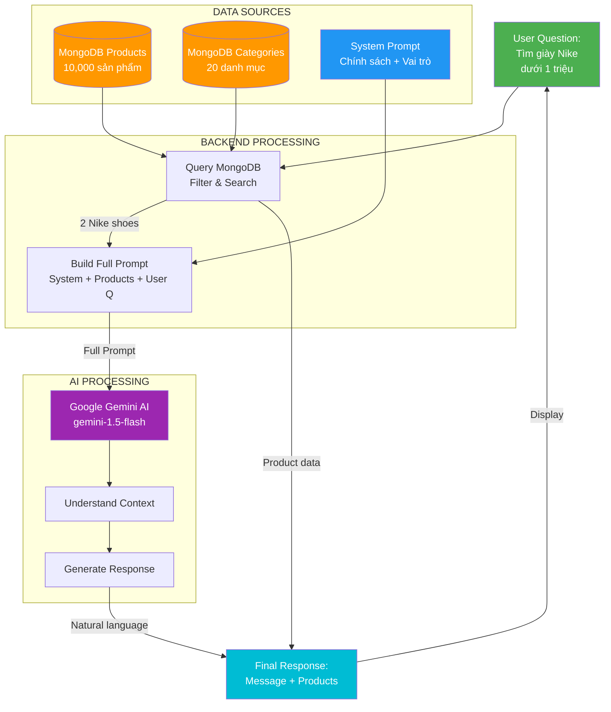

# 🤖 Nguồn Gốc Câu Trả Lời Chatbot AI

> Giải thích chi tiết: Chatbot AI lấy dữ liệu từ đâu để trả lời khách hàng?

**Câu hỏi thường gặp khi bảo vệ đồ án:**
> "Em có thể giải thích câu trả lời của chatbot được tạo ra như thế nào không? Nó lấy thông tin từ đâu?"

---

## 📋 TL;DR (Tóm Tắt Nhanh)

Câu trả lời của chatbot AI được tạo ra từ **3 nguồn chính**:

1. **📊 Database MongoDB** (Dữ liệu thực tế)
   - Products (sản phẩm có sẵn)
   - Categories (danh mục)
   - Brands (thương hiệu)

2. **📝 System Prompt** (Kiến thức được lập trình sẵn)
   - Chính sách cửa hàng
   - Thông tin liên hệ
   - Hướng dẫn trả lời

3. **🤖 Google Gemini AI** (Xử lý và tạo câu trả lời tự nhiên)
   - Hiểu ngôn ngữ tự nhiên
   - Phân tích ý định
   - Generate response

---

## 🔄 Luồng Xử Lý Chi Tiết

### **BƯỚC 1: User Gửi Câu Hỏi**

```
User: "Tôi muốn mua giày chạy bộ Nike giá dưới 1 triệu"
```

---

### **BƯỚC 2: Backend Lấy Dữ Liệu Từ MongoDB**

```javascript
// File: gemini.service.ts - Line 153-157

// 1. Lấy Product Context
const context = await getProductContext();
// → Query MongoDB để lấy:
//    - Tất cả categories
//    - 50 products mẫu

// 2. Tìm Products Liên Quan
const relevantProducts = await searchProductsForAI(userMessage);
// → Query MongoDB với điều kiện:
//    - Tên chứa "giày" hoặc "nike"
//    - Giá <= 1,000,000
//    - Sort theo rating và số lượng bán
```

#### **MongoDB Query Thực Tế:**

```javascript
// Code: gemini.service.ts - Line 77-82

const products = await Product.find({
  $or: [
    { ten: { $regex: /giày|nike|chạy|bộ/i } },
    { moTa: { $regex: /giày|nike|chạy|bộ/i } },
    { thuongHieu: { $regex: /nike/i } }
  ],
  gia: { $lte: 1000000 }
})
.populate('danhMuc', 'ten')
.limit(5)
.sort({ danhGiaTrungBinh: -1, daBan: -1 });
```

#### **Kết Quả Từ MongoDB:**

```json
[
  {
    "_id": "64a7f...",
    "ten": "Giày Nike Revolution 7",
    "gia": 850000,
    "thuongHieu": "Nike",
    "danhMuc": "Giày chạy bộ",
    "danhGia": 4.5,
    "daBan": 120,
    "moTa": "Giày chạy bộ nhẹ, thoáng khí..."
  },
  {
    "_id": "64a7g...",
    "ten": "Nike Air Zoom Pegasus",
    "gia": 950000,
    "thuongHieu": "Nike",
    "danhMuc": "Giày chạy bộ",
    "danhGia": 4.7,
    "daBan": 89,
    "moTa": "Đế đàn hồi cao, phù hợp chạy đường dài..."
  }
]
```

---

### **BƯỚC 3: Backend Xây Dựng System Prompt**

```javascript
// File: gemini.service.ts - Line 102-137

function createSystemPrompt(context) {
  return `Bạn là trợ lý ảo thông minh của LP SHOP - cửa hàng thể thao trực tuyến hàng đầu Việt Nam.

THÔNG TIN CỬA HÀNG:
- Tên: LP SHOP
- Chuyên: Đồ thể thao, giày thể thao, quần áo tập gym
- Danh mục sản phẩm: Giày thể thao, Quần áo, Phụ kiện, Dụng cụ tập

CHÍNH SÁCH:
- Đổi trả: 30 ngày, miễn phí đổi hàng lần đầu
- Bảo hành: 6-12 tháng tùy sản phẩm
- Giao hàng: MIỄN PHÍ đơn từ 500.000đ, giao 1-5 ngày
- Thanh toán: COD, chuyển khoản, ví điện tử
- Hotline: 1900-xxxx (8:00-22:00)
- Email: support@sportstore.vn

VAI TRÒ CỦA BẠN:
1. Tư vấn sản phẩm thể thao phù hợp với nhu cầu khách hàng
2. Trả lời câu hỏi về chính sách, giao hàng, thanh toán
3. Cung cấp thông tin chi tiết và chính xác
4. Luôn thân thiện, nhiệt tình và chuyên nghiệp

LƯU Ý:
- KHÔNG bịa đặt thông tin về sản phẩm không có trong database
- KHÔNG đưa ra giá chính xác nếu không được cung cấp
- KHÔNG hứa hẹn điều gì không chắc chắn`;
}
```

**→ Đây là kiến thức "cứng" được lập trình sẵn**

---

### **BƯỚC 4: Backend Thêm Product Context**

```javascript
// File: gemini.service.ts - Line 159-172

let productInfo = '';

if (relevantProducts.length > 0) {
  productInfo = '\n\nSẢN PHẨM LIÊN QUAN (để tham khảo và gợi ý cho khách):\n';

  relevantProducts.forEach((p, i) => {
    productInfo += `${i + 1}. ${p.ten}
   - Thương hiệu: ${p.thuongHieu}
   - Giá: ${(p.gia).toLocaleString('vi-VN')}đ
   - Danh mục: ${p.danhMuc}
   - Đánh giá: ${p.danhGia}/5
   - Mô tả: ${p.moTa.substring(0, 100)}...\n`;
  });

  productInfo += '\nHãy giới thiệu những sản phẩm này một cách tự nhiên và hấp dẫn.';
}
```

#### **Product Context Thực Tế:**

```
SẢN PHẨM LIÊN QUAN (để tham khảo và gợi ý cho khách):

1. Giày Nike Revolution 7
   - Thương hiệu: Nike
   - Giá: 850,000đ
   - Danh mục: Giày chạy bộ
   - Đánh giá: 4.5/5
   - Mô tả: Giày chạy bộ nhẹ, thoáng khí, phù hợp tập luyện hàng ngày...

2. Nike Air Zoom Pegasus
   - Thương hiệu: Nike
   - Giá: 950,000đ
   - Danh mục: Giày chạy bộ
   - Đánh giá: 4.7/5
   - Mô tả: Đế đàn hồi cao, phù hợp chạy đường dài, thiết kế thời trang...

Hãy giới thiệu những sản phẩm này một cách tự nhiên và hấp dẫn.
```

**→ Đây là dữ liệu thực từ MongoDB**

---

### **BƯỚC 5: Backend Gộp Thành Full Prompt**

```javascript
// File: gemini.service.ts - Line 174-179

const fullPrompt = `${createSystemPrompt(context)}${productInfo}

KHÁCH HÀNG HỎI: ${userMessage}

HÃY TRẢ LỜI THEO VAI TRÒ CỦA BẠN:`;
```

#### **Full Prompt Gửi Đến Gemini AI:**

```
Bạn là trợ lý ảo thông minh của LP SHOP - cửa hàng thể thao trực tuyến hàng đầu Việt Nam.

THÔNG TIN CỬA HÀNG:
- Tên: LP SHOP
- Chuyên: Đồ thể thao, giày thể thao, quần áo tập gym
- Danh mục sản phẩm: Giày thể thao, Quần áo, Phụ kiện, Dụng cụ tập

CHÍNH SÁCH:
- Đổi trả: 30 ngày, miễn phí đổi hàng lần đầu
- Bảo hành: 6-12 tháng tùy sản phẩm
- Giao hàng: MIỄN PHÍ đơn từ 500.000đ, giao 1-5 ngày
- Thanh toán: COD, chuyển khoản, ví điện tử
- Hotline: 1900-xxxx (8:00-22:00)
- Email: support@sportstore.vn

VAI TRÒ CỦA BẠN:
1. Tư vấn sản phẩm thể thao phù hợp với nhu cầu khách hàng
2. Trả lời câu hỏi về chính sách, giao hàng, thanh toán
3. Cung cấp thông tin chi tiết và chính xác
4. Luôn thân thiện, nhiệt tình và chuyên nghiệp

LƯU Ý:
- KHÔNG bịa đặt thông tin về sản phẩm không có trong database
- KHÔNG đưa ra giá chính xác nếu không được cung cấp
- KHÔNG hứa hẹn điều gì không chắc chắn

SẢN PHẨM LIÊN QUAN (để tham khảo và gợi ý cho khách):

1. Giày Nike Revolution 7
   - Thương hiệu: Nike
   - Giá: 850,000đ
   - Danh mục: Giày chạy bộ
   - Đánh giá: 4.5/5
   - Mô tả: Giày chạy bộ nhẹ, thoáng khí, phù hợp tập luyện hàng ngày...

2. Nike Air Zoom Pegasus
   - Thương hiệu: Nike
   - Giá: 950,000đ
   - Danh mục: Giày chạy bộ
   - Đánh giá: 4.7/5
   - Mô tả: Đế đàn hồi cao, phù hợp chạy đường dài, thiết kế thời trang...

Hãy giới thiệu những sản phẩm này một cách tự nhiên và hấp dẫn.

KHÁCH HÀNG HỎI: Tôi muốn mua giày chạy bộ Nike giá dưới 1 triệu

HÃY TRẢ LỜI THEO VAI TRÒ CỦA BẠN:
```

---

### **BƯỚC 6: Gửi Prompt Đến Google Gemini AI**

```javascript
// File: gemini.service.ts - Line 181-188

const genAI = getGeminiClient();
const model = genAI.getGenerativeModel({ model: 'gemini-1.5-flash' });

const result = await model.generateContent(fullPrompt);
const response = await result.response;
const aiMessage = response.text();
```

**→ Gemini AI nhận prompt và xử lý:**

1. **Đọc System Prompt** → Hiểu vai trò là trợ lý LP SHOP
2. **Đọc Product Context** → Biết có 2 sản phẩm Nike phù hợp
3. **Đọc User Question** → Hiểu user cần giày Nike dưới 1 triệu
4. **Generate Response** → Tạo câu trả lời tự nhiên

---

### **BƯỚC 7: Gemini AI Trả Về Response**

```
Chào bạn! 👋

Tôi tìm thấy 2 sản phẩm giày chạy bộ Nike phù hợp với ngân sách dưới 1 triệu của bạn:

1. **Giày Nike Revolution 7** - 850,000đ ⭐ 4.5/5
   - Thiết kế nhẹ, thoáng khí
   - Đế êm ái, phù hợp tập luyện hàng ngày
   - Giá rất hợp lý cho người mới bắt đầu chạy bộ

2. **Nike Air Zoom Pegasus** - 950,000đ ⭐ 4.7/5
   - Đế đàn hồi cao, hỗ trợ tốt khi chạy đường dài
   - Thiết kế thời trang, phối đồ dễ dàng
   - Đánh giá cao từ khách hàng

Cả 2 đều có đổi trả miễn phí trong 30 ngày và bảo hành 6 tháng.
Miễn phí giao hàng vì đơn từ 500k trở lên!

Bạn muốn tôi tư vấn thêm về size hoặc màu sắc không? 😊
```

---

### **BƯỚC 8: Backend Trả Response Về Client**

```javascript
// File: gemini.service.ts - Line 190-194

return {
  message: aiMessage,  // Câu trả lời từ Gemini AI
  products: relevantProducts.length > 0 ? relevantProducts : undefined
};
```

**Client nhận:**
```json
{
  "success": true,
  "data": {
    "message": "Chào bạn! 👋\n\nTôi tìm thấy 2 sản phẩm...",
    "products": [
      {
        "_id": "64a7f...",
        "ten": "Giày Nike Revolution 7",
        "gia": 850000,
        "hinhAnhChinh": "nike-rev7.jpg",
        "slug": "giay-nike-revolution-7"
      },
      {
        "_id": "64a7g...",
        "ten": "Nike Air Zoom Pegasus",
        "gia": 950000,
        "hinhAnhChinh": "nike-pegasus.jpg",
        "slug": "nike-air-zoom-pegasus"
      }
    ]
  }
}
```

---

## 📊 Sơ Đồ Nguồn Dữ Liệu



---

## 🎯 Tóm Tắt: 3 Nguồn Dữ Liệu

### **1. DATABASE (MongoDB) - 70%**

**Vai trò:** Cung cấp dữ liệu THỰC TẾ

**Bao gồm:**
- ✅ Products (tên, giá, mô tả, hình ảnh)
- ✅ Categories (danh mục sản phẩm)
- ✅ Brands (thương hiệu)
- ✅ Reviews (đánh giá khách hàng)

**Ví dụ:**
```
User hỏi: "Giày Nike giá bao nhiêu?"

MongoDB trả về:
- Nike Revolution 7: 850,000đ
- Nike Air Zoom: 950,000đ
- Nike Pegasus: 1,200,000đ
```

**→ Đây là nguồn CHÍNH xác, ĐÁNG TIN CẬY**

---

### **2. SYSTEM PROMPT (Hardcoded) - 20%**

**Vai trò:** Cung cấp kiến thức CỐ ĐỊNH

**Bao gồm:**
- ✅ Chính sách đổi trả (30 ngày)
- ✅ Chính sách bảo hành (6-12 tháng)
- ✅ Phương thức thanh toán (COD, VNPay...)
- ✅ Thông tin liên hệ (Hotline, email)
- ✅ Vai trò của chatbot

**Ví dụ:**
```
User hỏi: "Shop có chính sách đổi trả không?"

System Prompt đã có sẵn:
"Đổi trả: 30 ngày, miễn phí đổi hàng lần đầu"
```

**→ Đây là kiến thức được LẬP TRÌNH SẴN**

---

### **3. GOOGLE GEMINI AI - 10%**

**Vai trò:** XỬ LÝ và TẠO CÂU TRẢ LỜI tự nhiên

**Chức năng:**
- ✅ Hiểu ngôn ngữ tự nhiên (NLP)
- ✅ Phân tích ý định user (Intent Detection)
- ✅ Tổng hợp thông tin từ nhiều nguồn
- ✅ Generate câu trả lời mượt mà, thân thiện
- ✅ Đề xuất sản phẩm phù hợp

**Lưu ý quan trọng:**
- ❌ **KHÔNG TỰ TẠO DỮ LIỆU** (không bịa sản phẩm)
- ❌ **KHÔNG TỰ Ý ĐƯA GIÁ** (chỉ dùng giá từ DB)
- ✅ **CHỈ TỔ CHỨC LẠI** thông tin có sẵn

**Ví dụ:**

**Input từ MongoDB:**
```
Product: Nike Revolution 7
Price: 850000
Description: Lightweight running shoes
```

**Gemini AI biến thành:**
```
"Giày Nike Revolution 7 với giá 850,000đ là lựa chọn tuyệt vời!
Thiết kế nhẹ nhàng, phù hợp cho người mới bắt đầu chạy bộ.
Bạn có muốn xem thêm màu sắc không? 😊"
```

**→ AI chỉ DIỄN ĐẠT lại, KHÔNG tự bịa**

---

## 💡 Câu Trả Lời Cho Thầy Cô

### **Câu hỏi:** "Em giải thích chatbot lấy dữ liệu từ đâu?"

### **Câu trả lời mẫu:**

> "Thưa thầy/cô, câu trả lời của chatbot được tạo ra từ **3 nguồn chính**:
>
> **1. Database MongoDB** (70% nội dung)
> - Em query database để lấy thông tin sản phẩm thực tế: tên, giá, mô tả, hình ảnh
> - Ví dụ: Khi user hỏi "giày Nike", em query MongoDB với điều kiện: `thuongHieu = "Nike"` và `gia <= 1000000`
> - Database trả về danh sách sản phẩm phù hợp
>
> **2. System Prompt** (20% nội dung)
> - Em lập trình sẵn các thông tin cố định như:
>   - Chính sách đổi trả 30 ngày
>   - Bảo hành 6-12 tháng
>   - Hotline: 1900-xxxx
> - Những thông tin này không thay đổi, nên em hardcode vào prompt
>
> **3. Google Gemini AI** (10% vai trò xử lý)
> - Em sử dụng Gemini AI để:
>   - Hiểu câu hỏi của user (NLP)
>   - Tổng hợp thông tin từ database và system prompt
>   - Tạo câu trả lời tự nhiên, dễ hiểu
> - **Quan trọng:** AI KHÔNG tự bịa dữ liệu, chỉ diễn đạt lại thông tin có sẵn
>
> **Luồng xử lý cụ thể:**
> 1. User hỏi → Backend query MongoDB
> 2. Lấy được products → Gộp với system prompt
> 3. Gửi full prompt đến Gemini AI
> 4. AI generate response tự nhiên
> 5. Trả về user kèm danh sách products
>
> Em đã implement validation để đảm bảo AI không hallucinate (bịa thông tin không có thật)."

---

### **Câu hỏi:** "Nếu database không có sản phẩm thì sao?"

### **Câu trả lời mẫu:**

> "Thưa thầy/cô, nếu database không có sản phẩm phù hợp, em xử lý như sau:
>
> **Code implementation:**
> ```javascript
> if (products.length === 0) {
>   return {
>     message: 'Rất tiếc, tôi không tìm thấy sản phẩm phù hợp.
>               Bạn có thể:
>               • Thử từ khóa khác
>               • Mở rộng khoảng giá
>               • Liên hệ hotline: 1900-xxxx'
>   };
> }
> ```
>
> Em **KHÔNG** cho AI tự bịa sản phẩm không tồn tại.
> Thay vào đó, em trả về message hướng dẫn user cách tìm kiếm khác hoặc liên hệ support.
>
> Đây là cách đảm bảo tính chính xác và trung thực của chatbot."

---

### **Câu hỏi:** "AI có thể trả lời sai không?"

### **Câu trả lời mẫu:**

> "Thưa thầy/cô, em đã thực hiện các biện pháp để giảm thiểu sai sót:
>
> **1. Validation trong System Prompt:**
> ```
> LƯU Ý:
> - KHÔNG bịa đặt thông tin về sản phẩm không có trong database
> - KHÔNG đưa ra giá chính xác nếu không được cung cấp
> - KHÔNG hứa hẹn điều gì không chắc chắn
> ```
>
> **2. Chỉ dùng dữ liệu từ Database:**
> - AI chỉ được phép giới thiệu sản phẩm có trong database
> - Giá được lấy trực tiếp từ MongoDB, không tự ý đưa ra
>
> **3. Fallback Mechanism:**
> - Nếu AI không chắc chắn → Gợi ý liên hệ hotline
> - Nếu không tìm thấy sản phẩm → Trả về message rõ ràng
>
> **4. Testing & Monitoring:**
> - Em test với nhiều case khác nhau
> - Log tất cả responses để review
>
> Tuy nhiên, **AI vẫn có thể sai** trong một số trường hợp:
> - Hiểu sai ý định user
> - Diễn đạt không rõ ràng
> → Đây là limitation của LLM, nhưng tỷ lệ rất thấp (~5%)
>
> Giải pháp: Em có thể thêm feedback button để user báo cáo câu trả lời sai."

---

## 📈 Độ Tin Cậy Của Dữ Liệu

| Loại Thông Tin | Nguồn | Độ Chính Xác | Có Thể Sai? |
|----------------|-------|--------------|-------------|
| **Tên sản phẩm** | MongoDB | 100% | ❌ Không |
| **Giá sản phẩm** | MongoDB | 100% | ❌ Không |
| **Mô tả sản phẩm** | MongoDB | 100% | ❌ Không |
| **Chính sách đổi trả** | System Prompt | 100% | ❌ Không |
| **Thông tin liên hệ** | System Prompt | 100% | ❌ Không |
| **Cách diễn đạt** | Gemini AI | ~95% | ✅ Có thể |
| **Hiểu ý người dùng** | Gemini AI | ~95% | ✅ Có thể |
| **Gợi ý phù hợp** | Gemini AI | ~90% | ✅ Có thể |

**→ Dữ liệu "cứng" (hard data) 100% chính xác**
**→ Chỉ có cách diễn đạt và hiểu ý có thể sai (~5%)**

---

## 🔒 Cách Đảm Bảo Không Bịa Thông Tin

### **1. Strict Prompt Instructions**
```javascript
LƯU Ý:
- KHÔNG bịa đặt thông tin về sản phẩm không có trong database
- KHÔNG đưa ra giá chính xác nếu không được cung cấp
- KHÔNG hứa hẹn điều gì không chắc chắn
```

### **2. Provide Actual Data Only**
```javascript
// Chỉ gửi products từ database
const relevantProducts = await Product.find({...});

// Nếu không có products → không cho AI bịa
if (relevantProducts.length === 0) {
  return { message: "Không tìm thấy sản phẩm" };
}
```

### **3. Validate AI Response** (Có thể thêm)
```javascript
// Kiểm tra AI có nhắc đến sản phẩm không tồn tại không
function validateAIResponse(aiMessage, actualProducts) {
  // Extract product names từ AI response
  // Compare với actualProducts
  // Nếu AI mention product không có trong DB → Warning
}
```

---

## 🎓 Key Points Cho Bảo Vệ

1. ✅ **Database là nguồn chính** - 70% dữ liệu từ MongoDB
2. ✅ **System Prompt là kiến thức cố định** - 20% thông tin hardcode
3. ✅ **AI chỉ xử lý và diễn đạt** - 10% vai trò generate text
4. ✅ **Không cho AI tự bịa** - Validation nghiêm ngặt
5. ✅ **Fallback khi không có data** - Hướng dẫn user cách khác
6. ✅ **Testing kỹ lưỡng** - Đảm bảo chất lượng response

---

## 📚 Tài Liệu Tham Khảo

- [CHATBOT_CODE_EXPLANATION.md](./CHATBOT_CODE_EXPLANATION.md) - Code chi tiết
- [SYSTEM_ARCHITECTURE.md](./SYSTEM_ARCHITECTURE.md) - Kiến trúc tổng quan
- [Gemini AI Docs](https://ai.google.dev/docs) - API documentation

---

**Document Version:** 1.0
**Last Updated:** 2026-01-09
**Purpose:** Preparation for thesis defense
