# Tài liệu Biểu đồ Use Case - LP Shop

## 📋 Danh sách tài liệu

### 1. **USECASE.md** - Mô tả chi tiết Use Case
Tài liệu văn bản mô tả chi tiết tất cả các use case, actors, và mối quan hệ trong hệ thống.

📄 [Xem tài liệu USECASE.md](./USECASE.md)

### 2. **usecase-diagram.puml** - PlantUML Diagram
Biểu đồ Use Case dạng PlantUML, có thể render thành hình ảnh.

📄 File: `usecase-diagram.puml`

**Cách xem:**
- Sử dụng PlantUML extension trong VS Code
- Hoặc paste code vào: https://www.plantuml.com/plantuml/uml/
- Hoặc dùng CLI: `plantuml usecase-diagram.puml`

### 3. **usecase-diagram.mmd** - Mermaid Diagram
Biểu đồ Use Case dạng Mermaid, tích hợp tốt với GitHub/GitLab.

📄 File: `usecase-diagram.mmd`

**Cách xem:**
- Sử dụng Mermaid extension trong VS Code
- Hoặc xem trực tiếp trên GitHub (hỗ trợ mermaid)
- Hoặc paste code vào: https://mermaid.live/

---

## 🎨 Biểu đồ Use Case (Mermaid)

```mermaid
graph TB
    subgraph Actors
        Guest[👤 Khách vãng lai<br/>Guest]
        Customer[👤 Khách hàng<br/>Customer]
        Admin[👤 Quản trị viên<br/>Admin]
    end

    subgraph PublicFeatures[📱 Chức năng công khai]
        UC1[Xem danh sách<br/>sản phẩm]
        UC2[Xem chi tiết<br/>sản phẩm]
        UC3[Tìm kiếm<br/>sản phẩm]
        UC4[Lọc sản phẩm<br/>theo danh mục]
        UC5[Xem Flash Sale]
        UC6[Đăng ký<br/>tài khoản]
        UC7[Đăng nhập]
    end

    subgraph CustomerFeatures[🛒 Chức năng khách hàng]
        UC8[Thêm vào<br/>giỏ hàng]
        UC9[Quản lý<br/>giỏ hàng]
        UC10[Đặt hàng]
        UC11[Thanh toán]
        UC12[Xem lịch sử<br/>đơn hàng<br/>⚡ Real-time]
        UC13[Xem chi tiết<br/>đơn hàng]
        UC14[Hủy đơn hàng]
        UC15[Đánh giá<br/>sản phẩm]
        UC16[Quản lý<br/>yêu thích]
        UC17[Quản lý địa chỉ<br/>giao hàng]
        UC18[Cập nhật thông tin<br/>cá nhân]
        UC19[Xem thông báo<br/>⚡ Real-time]
        UC20[Xem điểm<br/>tích lũy]
        UC21[Đăng xuất]
    end

    subgraph AdminFeatures[⚙️ Chức năng quản trị]
        UC22[Quản lý<br/>sản phẩm]
        UC23[Quản lý<br/>danh mục]
        UC24[Quản lý<br/>đơn hàng]
        UC25[Cập nhật trạng thái<br/>đơn hàng<br/>⚡ Real-time sync]
        UC26[Quản lý<br/>người dùng]
        UC27[Quản lý<br/>đánh giá]
        UC28[Xem thống kê]
        UC29[Quản lý banner/<br/>khuyến mãi]
        UC30[Gửi thông báo]
        UC31[Quản lý<br/>newsletter]
    end

    Guest --> UC1
    Guest --> UC2
    Guest --> UC3
    Guest --> UC4
    Guest --> UC5
    Guest --> UC6
    Guest --> UC7

    Customer -.inherits.-> Guest
    Customer --> UC8
    Customer --> UC9
    Customer --> UC10
    Customer --> UC12
    Customer --> UC13
    Customer --> UC14
    Customer --> UC15
    Customer --> UC16
    Customer --> UC17
    Customer --> UC18
    Customer --> UC19
    Customer --> UC20
    Customer --> UC21

    Admin --> UC7
    Admin --> UC22
    Admin --> UC23
    Admin --> UC24
    Admin --> UC25
    Admin --> UC26
    Admin --> UC27
    Admin --> UC28
    Admin --> UC29
    Admin --> UC30
    Admin --> UC31

    UC10 -.include.-> UC11
    UC10 -.include.-> UC17
    UC24 -.include.-> UC25
    UC2 -.extend.-> UC15
    UC2 -.extend.-> UC16

    style UC12 fill:#DC2626,color:#fff
    style UC19 fill:#DC2626,color:#fff
    style UC25 fill:#DC2626,color:#fff
    style Guest fill:#6B7280,color:#fff
    style Customer fill:#16A34A,color:#fff
    style Admin fill:#F59E0B,color:#000
```



---

## 📊 Tổng quan hệ thống

### Actors (3)
- 👤 **Khách vãng lai (Guest)**: 7 use cases
- 👤 **Khách hàng (Customer)**: 21 use cases (bao gồm Guest)
- 👤 **Quản trị viên (Admin)**: 11 use cases

### Use Cases tổng cộng: 31

#### Chức năng công khai (7)
1. Xem danh sách sản phẩm
2. Xem chi tiết sản phẩm
3. Tìm kiếm sản phẩm
4. Lọc sản phẩm theo danh mục
5. Xem Flash Sale
6. Đăng ký tài khoản
7. Đăng nhập

#### Chức năng khách hàng (14)
8. Thêm vào giỏ hàng
9. Quản lý giỏ hàng
10. Đặt hàng
11. Thanh toán
12. ⚡ **Xem lịch sử đơn hàng** (Real-time polling 10s)
13. Xem chi tiết đơn hàng
14. Hủy đơn hàng
15. Đánh giá sản phẩm
16. Quản lý yêu thích
17. Quản lý địa chỉ giao hàng
18. Cập nhật thông tin cá nhân
19. ⚡ **Xem thông báo** (Real-time polling 10s)
20. Xem điểm tích lũy
21. Đăng xuất

#### Chức năng quản trị (10)
22. Quản lý sản phẩm
23. Quản lý danh mục
24. Quản lý đơn hàng
25. ⚡ **Cập nhật trạng thái đơn hàng** (Real-time sync to mobile)
26. Quản lý người dùng
27. Quản lý đánh giá
28. Xem thống kê
29. Quản lý banner/khuyến mãi
30. Gửi thông báo
31. Quản lý newsletter

---

## ⚡ Tính năng Real-time

### Polling (10 giây)
1. **UC12 - Xem lịch sử đơn hàng**: Mobile-app tự động cập nhật mỗi 10s
2. **UC19 - Xem thông báo**: Mobile-app tự động kiểm tra thông báo mới mỗi 10s
3. **UC25 - Cập nhật trạng thái đơn hàng**: Admin cập nhật → Mobile tự động sync sau 10s

### Luồng Real-time
```
Admin (Web) → Cập nhật trạng thái đơn hàng
     ↓
Backend API → Lưu vào Database
     ↓
Mobile App (Polling 10s) → Fetch dữ liệu mới
     ↓
UI Update → Hiển thị trạng thái mới cho Customer
```

---

## 🎨 Màu sắc hệ thống (Festive Theme)

- 🔴 **Primary (Đỏ)**: `#DC2626` - Christmas/Tết
- 🟢 **Secondary (Xanh)**: `#16A34A` - Cây thông
- 🟡 **Accent (Vàng)**: `#F59E0B` - Lì xì/Vàng

---

## 🔗 Mối quan hệ

### Include (Bắt buộc)
- UC10 (Đặt hàng) **include** UC11 (Thanh toán)
- UC10 (Đặt hàng) **include** UC17 (Địa chỉ giao hàng)
- UC24 (Quản lý đơn hàng) **include** UC25 (Cập nhật trạng thái)

### Extend (Tùy chọn)
- UC2 (Xem chi tiết sản phẩm) **extend** UC15 (Đánh giá)
- UC2 (Xem chi tiết sản phẩm) **extend** UC16 (Yêu thích)

### Generalization (Kế thừa)
- Customer **inherits** Guest (Customer có tất cả quyền của Guest + thêm chức năng riêng)

---

## 📱 Platforms

- **Admin Web**: `apps/admin-web/` - Next.js
- **Customer Web**: `apps/customer-web/` - Next.js
- **Mobile App**: `apps/mobile-app/` - React Native (Expo)
- **Backend API**: `apps/backend/` - Node.js/Express

---

**Cập nhật lần cuối**: 2025-12-24
**Tác giả**: LP Shop Development Team
